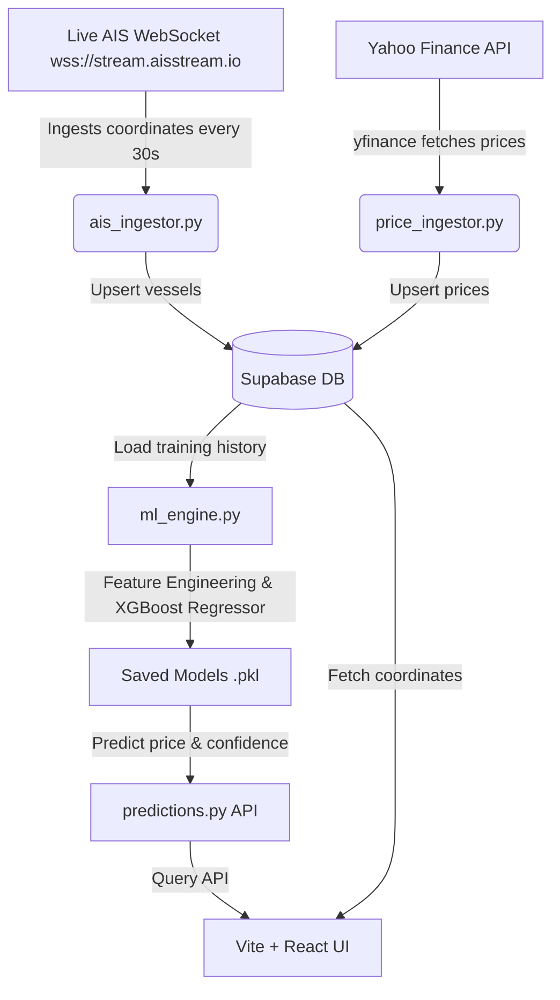

# Harbinger

Live AIS shipping data as a leading indicator for ML commodity price prediction.

## Overview

Harbinger is an end-to-end commodity intelligence platform. By subscribing to real-time Automatic Identification System (AIS) vessel telemetry over major shipping chokepoints, the platform measures physical supply flow changes, port queues, and shipping transit delays. This live activity is fed as a leading feature into machine learning predictors to forecast price fluctuations for physical commodities (Gold, Silver, Oil, and Copper).

## Architecture



## Tech Stack

- **Backend**: FastAPI (Python 3.10), Supabase client integration
- **Ingestion/Predictors**: Celery (task queue), Redis (broker), XGBoost, Scikit-Learn, Pandas, NumPy, yfinance, websockets
- **Frontend**: React 18, Vite, Tailwind CSS, Leaflet & React-Leaflet, Recharts, Axios

## Local Setup

### Prerequisites
- Python 3.10+
- Node.js 18+
- Redis Server

### Backend Configuration
1. Navigate to `/backend`
2. Copy `.env.example` to `.env` and configure:
   - `SUPABASE_URL` & `SUPABASE_KEY`
   - `AISSTREAM_API_KEY`
   - `REDIS_URL`
3. Install dependencies:
   ```bash
   pip install -r requirements.txt
   ```
4. Run server:
   ```bash
   uvicorn app.main:app --reload
   ```

### Frontend Configuration
1. Navigate to `/frontend`
2. Copy `.env.example` to `.env` and configure `VITE_API_URL`
3. Run dev client:
   ```bash
   npm install
   # Run local developer server
   npm run dev
   ```

## Deployment
- **Backend**: Deploys via the provided `Procfile` (uvicorn runner).
- **Frontend**: Build assets with `npm run build` and host on static CDNs (Vercel, Netlify, AWS S3).
- **CI/CD**: Auto-linting and build checks are established in `.github/workflows/deploy.yml`.

## Roadmap
- [ ] Incorporate satellite radar (SAR) imagery datasets.
- [ ] Expand prediction models to agricultural commodities (Wheat, Soybeans).
- [ ] Build global ports congestion maps with predictive queuing metrics.
